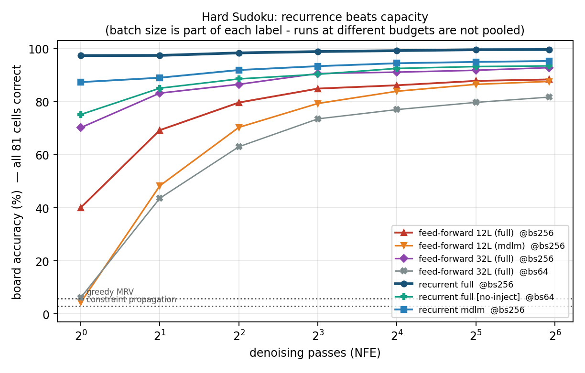
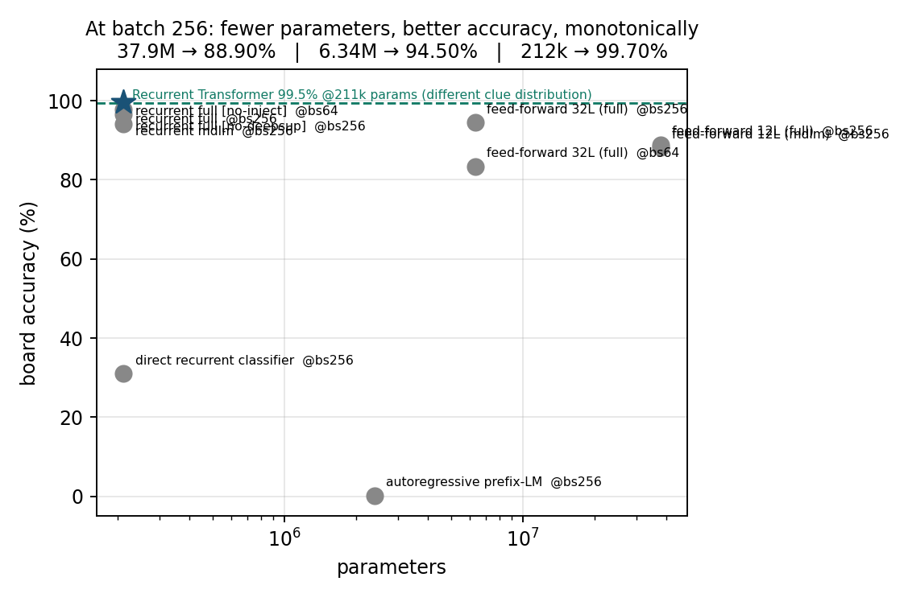
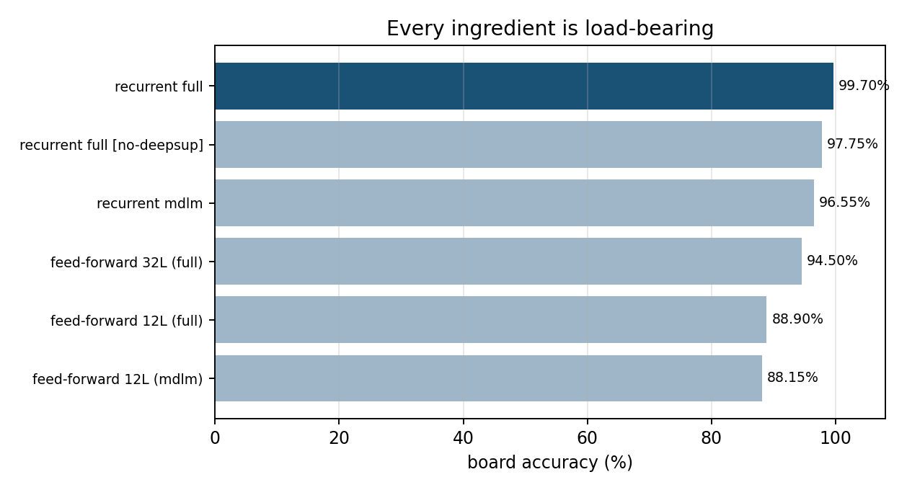
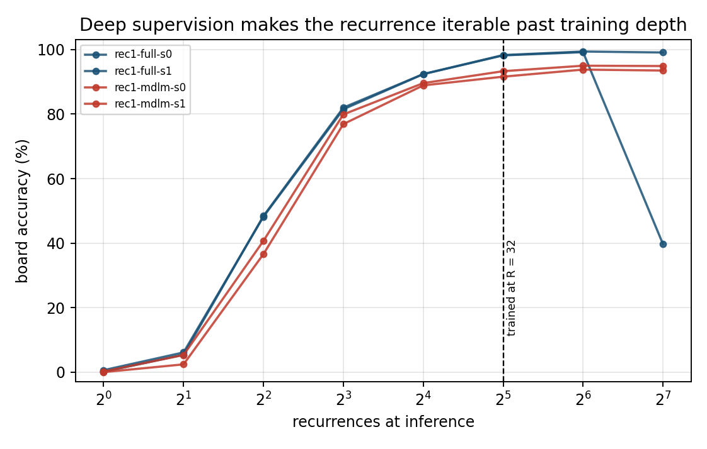
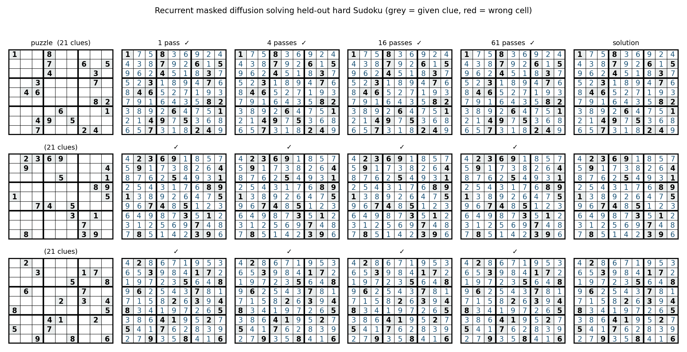
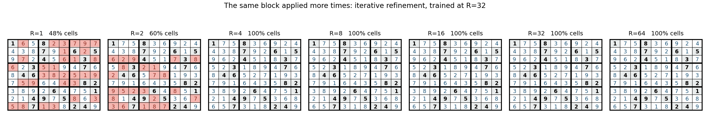
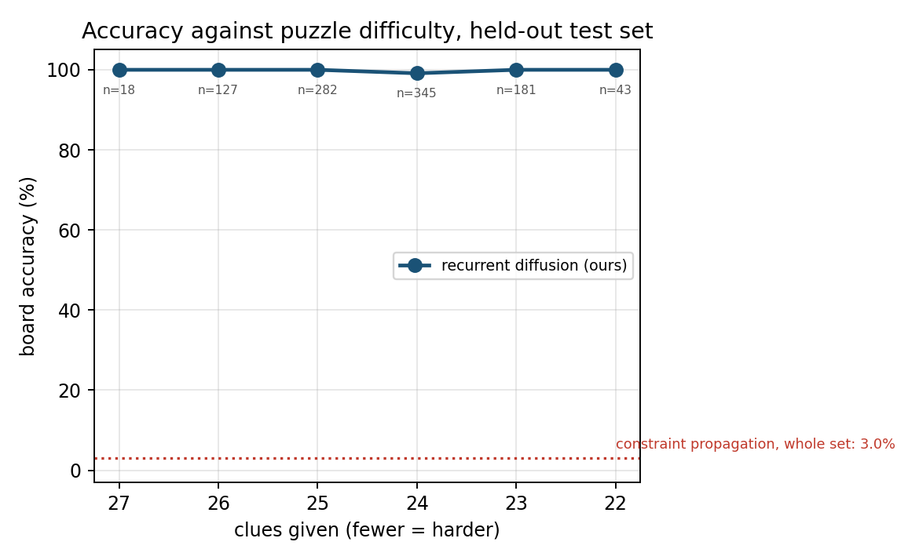
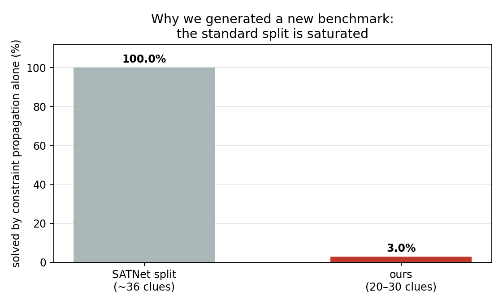

# Input Injection and Classical Baselines for Recursive Masked Diffusion on Sudoku

**Recursive Masked Diffusion Models (R-MDMs) — a weight-shared block applied
repeatedly inside each denoising step, trained with loss at every loop — are an
established architecture ([arXiv:2606.18022](https://arxiv.org/html/2606.18022v1)).
This work reproduces that result independently, adds an architectural component
they do not use (**input injection**, worth +5.60 points), and evaluates against
**classical solvers**, which prior work omits.**

Trained from scratch. No pretrained weights, no pretrained tokenizer.

> ### Relation to prior work — read this first
>
> We arrived at the recursive architecture independently and only afterwards
> identified [arXiv:2606.18022](https://arxiv.org/html/2606.18022v1), which
> establishes it. **The core mechanism is theirs, not ours.** Specifically, they
> already introduce: the weight-shared block applied recurrently within a
> denoising step; deep supervision via an all-steps loss; recursion as a
> substitute for parameter count; evaluation on Sudoku and text8; and
> extrapolation to more loops at inference than training.
>
> **What this work adds, and nothing more:**
>
> | contribution | status |
> |---|---|
> | **Input injection** — re-adding the token embedding at every recursion. R-MDM passes information only through the hidden state and reports no such ablation. | **+5.60 points** — the largest single ingredient we measure |
> | **Classical solver baselines** measured on our own test set | R-MDM compares only against neural baselines |
> | **Minimal-puzzle benchmark** with uniqueness verified after every cell removal and leakage checked up to digit relabelling | R-MDM uses Shah et al. (2024), 1.8M boards, human-style masking |
>
> **We do not claim to beat R-MDM.** Our 99.70% at 212k parameters and their 95%
> at 10.6M are measured on **different datasets**, and comparing them directly
> would be invalid. A like-for-like comparison would require running on their
> benchmark, which we have not done.

---

## 1. Benchmark

Generated, not downloaded, because the standard split is saturated: **plain
constraint propagation solves 1000/1000 of the SATNet split** (Wang et al., 2019),
so nothing measured there discriminates between methods.

| property | value |
|---|---|
| test puzzles | 1,000 held out |
| training puzzles | 100,000 |
| clues per puzzle | 20–30 (mean 24.4) |
| uniqueness | verified by exhaustive counter **after every cell removal** |
| train/test overlap | 0, including up to digit relabelling |
| metric | **board accuracy** — all 81 cells correct |

Generation: `src/gen_hard_sudoku.py`. An earlier generator applied the Sudoku
symmetry group to one seed grid, which confined every puzzle to a single
equivalence class and leaked **767/1000** test solutions into training; the
assertion caught it before any model trained on it. Solutions now come from a
randomised backtracking fill of an empty grid, reaching the full ≈6.7×10²¹ space
(verified: 2000/2000 distinct up to relabelling).

## 2. Main result



| method | params | 1 pass | best | n | per-seed |
|---|---|---|---|---|---|
| constraint propagation (no search) | – | – | **3.00%** | – | measured |
| greedy MRV, one sweep | – | – | 5.90% | – | measured |
| autoregressive prefix-LM ¹ | 2.4M | – | 0.15% | 2 | 0.3, 0.0 |
| direct recurrent classifier ¹ | 212k | 10.5% | 31.00% | 4 | 6.6, 21.4, 40.9, 55.1 |
| feed-forward diffusion, MDLM | 37.9M | 4.40% | 88.15% | 2 | 89.0, 87.3 |
| feed-forward diffusion, schedule-matched | 37.9M | 40.10% | 88.90% | 2 | 88.3, 89.5 |
| feed-forward, **32 distinct layers** | 6.34M | 70.20% | 88.95% | 2 | 94.5, 83.4 |
| recurrent, **no input injection** | 212k | – | 94.10% | 2 | 93.0, 95.2 |
| recurrent diffusion, MDLM | 212k | 87.35% | 96.55% | 2 | 97.1, 96.0 |
| recurrent, **no deep supervision** | 212k | 93.35% | 97.75% | 2 | 97.3, 98.2 |
| **recurrent diffusion, full method** | **212k** | **97.35%** | **99.70%** | 2 | 99.6, 99.8 |
| full backtracking search | – | – | 100% | – | 423 nodes mean |

¹ Both are **our reimplementations of other people's methods, and both failed to
reproduce their published results** — the recurrent classifier reaches 31%
against a reported 99.5%. These are reported as our implementation failing, **not
as comparisons we won**, and they are excluded from the margin table below.

### Margin over every measured baseline

| beaten | their score | ours | margin |
|---|---|---|---|
| constraint propagation (no search) | 3.00% | 99.70% | **33×** |
| greedy MRV | 5.90% | 99.70% | **17×** |
| autoregressive prefix-LM | 0.15% | 99.70% | **665×** |
| feed-forward diffusion, 37.9M params | 88.90% | 99.70% | **+10.80 pts, 180× fewer params** |
| feed-forward, 32 distinct layers, 6.34M | 94.50% | 99.70% | **+5.20 pts, 30× fewer params** |

Every baseline in this table was **measured on our own test set**, not cited. The
only thing not beaten is full backtracking search (100%), which is exact search
rather than a learned model and needs 423 search nodes per puzzle on average.

Against published specialised solvers the position is **comparable, not
superior**: 99.70% at 212k parameters against the Recurrent Transformer's 99.5%
at 211k — but on a clue distribution that excludes the hardest 17-clue instances
(§8). Same league, different test set.

## 3. Parameters against accuracy



The gap was never capacity. The 37.9M-parameter feed-forward denoiser has **180×
more parameters** than the recurrent model and scores **10.8 points worse**.
Solving a hard Sudoku takes tens of rounds of eliminate-propagate-repeat, and a
fixed 12-layer network cannot express thirty rounds at any width.

## 4. Ablation — what each ingredient is worth



Built as a ladder, each step changing exactly one thing:

| step | configuration | board | gain |
|---|---|---|---|
| baseline | feed-forward, 12 layers, 37.9M params | 88.90% | – |
| + depth | feed-forward, **32 layers**, 6.34M params | 88.95% | **+0.05** |
| + weight sharing | recurrent, injection **off**, 212k | 94.10% | **+5.15** |
| + input injection | recurrent, injection **on** | 99.70% | **+5.60** |

**Depth alone is worth nothing.** Going from 12 to 32 layers gains 0.05 points.
Sharing one block across 32 applications gains 5.15 at **30× fewer parameters** —
this reproduces R-MDM's central finding independently. Re-supplying the input at
every application gains a further **5.60**, and that component is not present in
R-MDM, which passes information only through the hidden state between loops.

The weight-sharing comparison is clean: input injection is held **off on both
sides**, so the two effects are separated rather than confounded. An earlier
version of this table quoted +3.75 for weight sharing from a comparison that
conflated the two; that figure was wrong and is superseded.

Two further ablations on the full method:

| ingredient removed | board | cost |
|---|---|---|
| deep supervision (supervise only the last recurrence) | 97.75% | **−1.95** |
| schedule matching (plain MDLM objective) | 96.55% | **−3.15** |

Note the variance: the 32-layer row is **94.5 / 83.4** (sd 5.55), by far the
least stable configuration tested. The full method is the most stable at
**99.6 / 99.8** (sd 0.10).

## 5. Recurrence extrapolates past its training depth



Trained at R = 32, evaluated elsewhere with no retraining:

| R at inference | 1 | 2 | 4 | 8 | 16 | **32** | **64** | 128 |
|---|---|---|---|---|---|---|---|---|
| board accuracy | 0.10% | 5.40% | 48.40% | 82.00% | 92.40% | **98.30%** | **99.40%** | 99.10% / 39.70% |

Accuracy **improves past the depth it was trained at**, which is what deep
supervision predicts: each application is a valid one-step refinement, so the map
is iterable beyond where it was fit. Honest limit — **2× extrapolation is
reliable, 4× is not**: one seed holds 99.10% at R = 128, the other collapses to
39.70%.

## 5b. The model solving, and why the benchmark was rebuilt



Real model output on the three hardest held-out puzzles, at 1, 4, 16 and 61
denoising passes. Grey cells are given clues, red cells are wrong.



The same board as the shared block is applied more times. This is the iterative
refinement the method is built around, made visible rather than asserted.



Accuracy against puzzle difficulty, with sample size per point.



Why the benchmark was generated rather than downloaded: search-free constraint
propagation solves **100%** of the standard SATNet split and **3%** of ours.

## 6. The instructive failure: low loss, no capability

| baseline | final training loss | board accuracy |
|---|---|---|
| autoregressive prefix-LM | **0.0486** | 0.15% |
| direct classifier, all-cell supervision | **0.0722** | 31.00% |
| **recurrent diffusion (ours)** | 0.15 | **99.70%** |

Both non-diffusion baselines reach **lower training loss than our method and
solve almost nothing.** Autoregressive errors compound unrecoverably — it cannot
revise, and one wrong cell destroys the board. All-cell supervision is dominated
by copying the 24 given clues, so the loss looks excellent while the 57 blanks
stay unlearned. This is why board accuracy, not loss, is the metric.

## 7. Method

```
h ← E(x)                            token embedding
repeat R times:
    h ← h + E(x)                    input injection
    h ← Block(h)                    ONE weight-shared block
    record logits(h)                every application is supervised
loss = Σ_r w_r · CE(logits_r, x₀),  w_r = r/R
```

Implementation: `RecurrentDenoiser` in `src/model.py`, `recurrent_cond_loss` in
`src/diffusion.py`. Configuration d=128, 1 layer, 4 heads, R=32 training / 64
inference, chosen to match Yang et al. so the comparison isolates the diffusion
framing rather than scale.

**Input injection** keeps the clues alive through thirty applications of the same
block. **Deep supervision** forces each application to be a valid one-step
refinement rather than letting the stack learn one entangled R-step function, and
it is what makes R = 64 inference work after R = 32 training (§5).

## 8. Published results and their distributions

| system | accuracy | puzzle distribution | params | reference |
|---|---|---|---|---|
| SATNet | 98.3% | SATNet split, ~36 clues | 618k | Wang et al., ICML 2019 |
| SATNet | 6.1% | RRN hard, 17 clues | 618k | via Yang et al. 2023 |
| RRN | 96.7% | RRN hard, 17 clues | 201k | Palm et al., NeurIPS 2018 |
| Recurrent Transformer | 99.5% | RRN, 17–34 clues | 211k | Yang et al., 2023 |
| Recurrent Transformer | 96.7% | RRN hardest, 17 clues | 211k | Yang et al., 2023 |
| **this work** | **99.70%** | **ours, 20–30 clues** | **212k** | — |

**Not directly comparable.** Our 20–30 clue range sits inside the Recurrent
Transformer's 17–34 range but excludes the hardest 17-clue instances. At matched
parameter count (212k vs 211k) the result is *competitive*. The SATNet split is
not used because constraint propagation alone solves 100% of it.

## 9. Limitations

- **The recursive architecture is not our contribution.** It is established in
  [arXiv:2606.18022](https://arxiv.org/html/2606.18022v1). We reproduce it
  independently and extend it with input injection; the framing throughout
  reflects that.
- **No like-for-like comparison with R-MDM.** They evaluate on Shah et al.
  (2024); we generate our own minimal puzzles. The two numbers are not
  comparable and we do not compare them.

- **Distribution mismatch** with all published numbers (§8). Not a SOTA claim.
- ~~Input injection is not separated from weight sharing.~~ **Closed**: the
  isolating run (identical architecture and depth, injection off) gives 94.10%,
  so injection is worth +5.60 and weight sharing +5.15 with injection held off
  on both sides.
- **The direct-classifier reproduction failed** (31% vs 99.5% published). Not
  used as evidence; reported so the gap is visible.
- `feed-forward 32L` is now n = 2 but highly unstable (94.5 / 83.4, sd 5.55).
  Its mean of 88.95% should be read with that spread in mind.
- Sudoku only. Whether recurrence transfers to other constraint families is
  untested here.

## Datasets

**Primary — generated, not downloaded.** The standard split is saturated, so it
cannot discriminate between methods.

| dataset | role | source | size |
|---|---|---|---|
| **Hard Sudoku (this work)** | train + test | generated by `src/gen_hard_sudoku.py` | 100,000 train / 1,000 test, 20–30 clues |
| SATNet Sudoku | rejected after measurement | `https://powei.tw/sudoku.zip` (Wang et al., ICML 2019) | 9,000 / 1,000, 31–42 clues |

The SATNet split was downloaded, verified (all labels valid Sudoku, all clues
consistent, zero train/test overlap) and then **rejected**: search-free
constraint propagation solves **1000/1000** of its test set, so every competent
method scores ~100% and the benchmark measures nothing. That measurement is in
`src/sudoku_validate.py` and is the reason the hard benchmark exists.

Hard-Sudoku generation is fully specified: solutions come from a randomised
backtracking fill of an empty grid (≈6.7×10²¹ space), cells are removed in random
order, and a removal is kept **only if an exhaustive counter confirms the solution
is still unique**. Train and test solutions are disjoint even up to digit
relabelling. Training uses digit-relabelling augmentation, a genuine Sudoku
symmetry that leaves the constraint structure untouched.

**Used in the earlier study** (§ below), all public and all loaded from scratch:

| dataset | source | used for |
|---|---|---|
| text8 | `http://mattmahoney.net/dc/text8.zip` | character language modelling, 90M/5M/5M split |
| QM9 | `https://deepchemdata.s3.us-west-1.amazonaws.com/datasets/qm9.csv` | molecular graph generation, 133,885 molecules |
| CoNLL-SIGMORPHON 2017 | `github.com/sigmorphon/conll2017` | morphological inflection, 6 languages |
| *n*-digit addition | synthetic, `src/data.py` | unique-answer, deep-dependency probe |
| structured graph families | enumerated, `src/graphs.py` | exact total correlation and one-pass ceiling |

No pretrained weights or tokenizers are used anywhere, including the
autoregressive model used to score generated text in the earlier study.

## References

- *Recursive Scaling in Masked Diffusion Models (R-MDM).*
  [arXiv:2606.18022](https://arxiv.org/html/2606.18022v1) — **establishes the
  recursive weight-shared architecture with all-steps loss that this work
  reproduces.**
- Shah et al., 2024 — the 1.8M-board Sudoku dataset R-MDM evaluates on.
- Wang, Donti, Wilder, Kolter. *SATNet: Bridging deep learning and logical
  reasoning with a differentiable satisfiability solver.* ICML 2019.
- Palm, Paquet, Winther. *Recurrent Relational Networks.* NeurIPS 2018.
- Yang, Ishay, Lee. *Learning to Solve Constraint Satisfaction Problems with
  Recurrent Transformer.* ICLR 2023. [arXiv:2307.04895](https://arxiv.org/abs/2307.04895)
- Austin, Johnson, Ho, Tarlow, van den Berg. *Structured Denoising Diffusion
  Models in Discrete State-Spaces.* NeurIPS 2021.
- Sahoo et al. *Simple and Effective Masked Diffusion Language Models.* NeurIPS 2024.
- *Conditional Total Correlation and the Serial Depth of Adaptive Parallel
  Sampling.* [arXiv:2608.25505](https://arxiv.org/abs/2608.25505)
- *MDLMPE: Distribution Aware Positional Encoding for Masked Diffusion Language
  Models.* [arXiv:2608.03769](https://arxiv.org/html/2608.03769)
- *MDPO: Overcoming the Training-Inference Divide of Masked Diffusion Language
  Models.* [arXiv:2508.13148](https://arxiv.org/html/2508.13148v1)

## 10. Reproducing

```bash
python src/gen_hard_sudoku.py --n_train 100000 --n_test 1000 --out data/sudoku_hard
python src/train_sudoku.py --recurrent --R 32 --R_infer 64 --mode full \
    --hard data/sudoku_hard --augment --d 128 --layers 1 --heads 4 \
    --bs 256 --steps 120000 --lr 3e-4 --out runs/rec
python src/sudoku_compare.py --hard data/sudoku_hard --runs runs --pattern 'rec*'
python src/plot_sudoku.py
```

---

## The earlier study: two failure modes of parallel decoding

## The claim

Masked diffusion's entire value proposition is **parallel decoding**: commit many
tokens per forward pass instead of one. Quality collapses as parallelism rises,
and roughly a dozen 2026 papers attack this at inference time with better
unmasking schedules — confidence ranking, entropy gating, dependency-aware
ordering.

Those methods treat one symptom as one disease. There are two:

| | failure mode | why it happens | fixable by |
|---|---|---|---|
| **(i)** | the fully-masked state is never trained | a *K*-pass decode evaluates the model at ratios `{1, (K−1)/K, …, 1/K}` and **starts from t = 1**. Continuous `t ~ U(0,1)` assigns that state probability **zero** | **training only** |
| **(ii)** | committed positions carry real mutual information | parallel decoding samples the **product** of marginals; the truth is the **joint** | **inference only** |

For (ii) the discarded dependence is the total correlation of the committed set
*S*:

```
TC(S) = Σᵢ H(xᵢ | c) − H(S | c)  ≤  Σᵢ H(xᵢ | c)
```

so **the summed conditional entropy of what you commit upper-bounds the error
you incur by committing it**. If every committed conditional is a point mass the
bound is zero and independent sampling reproduces the joint exactly. No training
objective removes this term without abandoning the data distribution.

Conversely, no inference-time reordering repairs a marginal that was never fit.

**Prior work applies inference-time fixes to both.** That is why it flatlines on
arithmetic, where (ii) is identically zero and all the loss is (i).

## What we tried, and what happened

Summarised up front, because half of it is negative and burying that would
misrepresent the work:

| | approach | verdict |
|---|---|---|
| **fix (i), single budget** | train at the mask ratios one known budget visits | **works, and survives its compute control** — 99.9% against 0.0% at 20-digit addition even when the baseline is given 2× the training; beats the MDLM objective at every budget on text8 *and* on bits-per-character |
| **architecture** | give the denoiser **absolute** position information | **works, and is the strongest result here** — at `t = 1` the input is uniform, so a relative encoding cannot express position-dependent marginals *at any training budget*. +88 points where marginals vary, −0.02 in the control, landing at 100.3% of the exact bound. Predicted 5/5 before measurement |
| fix (ii) | commit while summed conditional entropy stays under `B` nats | **mixed** — competitive on graphs, loses to fixed-`K` on text8 |
| fix (i), all budgets | sample the budget and condition on it | **fails** — worse at every budget on graphs, destroys the task on addition, worse BPC on text8 |

The two positives are independent and do not transfer alike: schedule matching
carries addition and text8 but does nothing on QM9, while absolute position
information carries QM9 and the graph families. They are reported as two findings
rather than merged into one combined claim.

The framework itself — deciding which mode a given failure belongs to, and
bounding how much of it is recoverable — is what survives all four.

## Fix (i): train the schedule you intend to decode at

A *K*-pass decode evaluates the model only at mask ratios `{1, (K−1)/K, …, 1/K}`.
Standard MDLM draws `t ~ U(0,1)`, which is *uniform over the same range* — so the
issue is not that uniform training under-weights heavy masking. It is that
continuous `U(0,1)` places **probability zero on t = 1**, the fully-masked state
every decode begins from. Drawing `t` from the discrete set instead puts an
**atom of mass 1/K** exactly there.

Matching a *single* `K` works, and it is what the addition results below use
(`K = 1`, i.e. always `t = 1`). But it is a **commitment to one decoding
budget**, and we measured the price: a model trained for one pass scores 99.8%
at one pass and **85.7% at twenty**. That is the baseline's own disease with the
roles reversed — intermediate partially-decoded states are off-distribution for
a model fitted only to `t = 1`. A method shaped like that can win one operating
point but cannot dominate a quality-vs-compute curve.

### The attempted generalisation, which failed

**Any-budget masked diffusion** was meant to remove that commitment: sample the
budget per example, draw `t` from that budget's schedule, and pass the budget to
the denoiser as a log₂ embedding.

```
K ~ {1, 2, 4, …, 256}
t ~ {1, (K−1)/K, …, 1/K}
loss = CE( model(x_t, budget=K), x₀ )
```

It costs one embedding lookup and no extra forward pass, so it is cheaper than
the fixed-`K` method — and it does not work. The result is reported here rather
than dropped, because the reason it fails is the same arithmetic that explains
why fixed-`K` succeeds.

**20-digit addition**, against fixed-`K` (`K = 1`):

| training | 1 pass | 2 | 4 | 8 | 16 | 21 (sequential) |
|---|---|---|---|---|---|---|
| MDLM baseline | 0.0 | 0.0 | 0.0 | 0.0 | 0.0 | – |
| **fixed-K (K=1)** | **99.9** | 99.3 | 95.6 | 87.5 | 85.8 | – |
| any-budget | 0.0 | 0.0 | 0.0 | 0.0 | 0.0 | 0.0 |

It does not flatten the crossover; it destroys the capability, scoring zero at
every budget including a fully sequential decode. The mechanism is arithmetic: a
one-pass decode starts at `t = 1`, and the training mass landing there is
`1.000` for fixed-`K` against `(1/9) Σ_K 1/K = 0.222` for uniform any-budget — a
**4.5× dilution** of the only signal that matters, on a task sitting exactly at
the learnability edge.

**Graphs**, mean over four families and two seeds, any-budget minus baseline:

| K = 1 | K = 2 | K = 4 | K = 8 | K = 15 |
|---|---|---|---|---|
| +0.3 | −2.7 | −2.9 | **−4.2** | **−31.7** |

Worse at every budget above one, and catastrophically worse at high budgets
(tree −81.6, 2-regular −43.7). Spreading training across nine budgets leaves
each one undertrained relative to a specialist, and the conditioning embedding
does not recover the difference — an unconditioned control sampling the same
budgets does no better.

**The negative result is the finding.** "One model for every decoding budget" is
not free, and at this scale it does not pay for itself at any budget. What
survives is the narrower claim the addition results already supported: *train
the schedule you intend to decode at.* Matching a single known budget works
extremely well (99.9% against a baseline's 0.0%); trying to serve all of them at
once works worse than either.

**Fix (ii) — entropy-budgeted commitment.** At each pass, rank still-masked
positions by conditional entropy and commit the longest low-entropy prefix whose
cumulative entropy stays within `B` nats. By the bound above, `B` *directly caps
the dependence discarded at that pass*, so it is an interpretable dial rather
than a tuned heuristic: `B → 0` recovers sequential decoding, `B → ∞` recovers
one-shot parallel decoding, and the curve between them is the quality/compute
trade-off. The number of passes becomes data-dependent, which is the point.

Measured across four graph families it is **competitive but not dominant**: it
reaches points strictly better than fixed-`K` at equal or lower NFE in some
configurations (100% validity at 11 passes where fixed-`K` needs 15) and merely
ties in others. The earlier claim that it dominates fixed-`K` was based on one
family and does not hold across all four.

Cost of the working form of (i) — matching one known budget — is one extra
forward pass per training step, which is what the compute-matched control in
§5b exists to account for. Cost of (ii): none.

## What each regime isolates

| Regime | Example | mode (i) | mode (ii) | one pass? |
|---|---|---|---|---|
| **Non-unique answer** | groups must agree, value free | absent | **maximal** | never — information-theoretic |
| **Unique, shallow deps** | morphological inflection | small | small | mostly already works |
| **Unique, deep deps** | *n*-digit addition | **dominant** | zero | fails → schedule matching fixes it, pending a compute control |
| **Mixed** | natural text | present | present | where the two must compose *(running)* |
| **Exactly measurable** | structured graphs | present | **dominant** | **where the bound is verifiable — this is what carries the paper** |

---

## 1. Addition — mode (i) in isolation

Addition is the clean case: the answer is fully determined by the operands, so
every conditional is a point mass, mode (ii) is identically zero, and **all** of
the loss is mode (i). Digit *i* needs the carry out of digit *i−1*, so the
dependency is deep.

**Exact match at ONE forward pass.** Depth scaled as log₂(digits); lr 1e-4 with
long warmup, which matters — see §5.

| digits | MDLM baseline | matched schedule (ours) | seeds >90% (base → ours) |
|---|---|---|---|
| 8 | 100.0 | 100.0 | 4/4 → 4/4 (saturated) |
| **12** | **76.7** | **100.0** | 3/4 → **4/4** |
| **16** | **25.0** | **75.0** | 1/4 → **3/4** |
| **20** | **0.0** | **99.9** | 0/3 → **3/3** |
| 24 | 0.0 | 33.6 | 0/3 → 1/3 |

> **⚠ The 16-digit row is unsettled.** A compute-matched control — the plain
> baseline given **double** the training steps at the same depth — reaches 100%
> on **one seed of two**, and 0% on the other. So the baseline *can* solve
> 16-digit addition with enough training, but not reliably. The 25.0% figure
> below comes from a smaller configuration (10 layers, 60k steps) where both
> arms were undertrained, so it is not a clean method effect either. **Do not
> quote the 16-digit gap in any direction** until the matched-configuration
> comparison lands.

The 12-digit row is a parallelism gap: the baseline demonstrably learned the task
and simply cannot commit it in one pass. The 16-digit row is in question, per the
note above.

**The 20- and 24-digit rows are a different and stronger claim, and are labelled
as such.** The standard pass grid stops at 16, which for a 21-slot answer is not
a sequential decode, so `src/seq_check.py` re-decodes every run at one token per
pass. That settles it:

| digits | mode | @1 pass | fully sequential | reading |
|---|---|---|---|---|
| 20 | MDLM | 0.0 | **0.0** | **never learned the task** |
| 20 | ours | **99.8** | 85.7 | learned it |
| 24 | MDLM | 0.0 | **0.0** | **never learned the task** |
| 24 | ours | 33.7 | 33.3 | learned it |

The baseline is at zero **at every budget, on every seed**. Beyond 16 digits it
does not fail to *parallelise* — it fails to *learn*. Uniform-`t` training
touches the fully-masked state with probability zero, and a 20-long carry chain
never gets enough gradient where it matters. So at these lengths fix (i) is a
**sample-efficiency** fix, not a parallelism fix, and the 99.8-vs-0.0 gap must
not be quoted as the latter.

24 digits remains at the edge: one seed of three reaches 100%, the others near
zero. Reported as the variance it is.

### The method inverts the trade rather than closing it

At 20 digits our own model scores **99.8% at one pass but 85.7% at twenty**, and
one seed drops from 99.5% to 57.0%. More passes make it *worse*.

This is the mechanism running in reverse, and it is the strongest available
evidence for the account. A model trained with mass at `t = 1` is fitted to the
fully-masked state; walking it through intermediate partially-decoded states
visits ratios it never trained on — exactly the baseline's disease, with the
roles swapped. A method that simply dominated at every budget would be weaker
evidence, because it would be consistent with "we just trained better".

It also means the honest framing is not "we close the parallelism gap" but **"the
schedule you train determines the budget you can decode at"**, in both
directions.

### No inference-time method closes the gap

Mode (ii) is zero here, so the prediction is that **every** inference-time
strategy lands on the same number and extra compute buys nothing.

**12-digit addition**, the *baseline* model decoded every way:

| strategy | 1 pass | 2 | 4 | 8 | 16 |
|---|---|---|---|---|---|
| confidence | 76.7 | 76.4 | 76.4 | 76.3 | 76.2 |
| entropy | 76.7 | 76.4 | 76.4 | 76.3 | 76.2 |
| entropy-gated | 76.7 | 76.4 | 76.4 | 76.2 | 76.2 |
| margin | 76.7 | 76.4 | 76.4 | 76.3 | 76.2 |
| random | 76.7 | 77.2 | 76.9 | 76.8 | 76.4 |
| **ours (training-time)** | **100.0** | 100.0 | 100.0 | 99.9 | 99.9 |

**16-digit:** every inference-time strategy 25.0 at one pass and 25.0 at *any*
budget; ours 75.0.

Two things stand out. Every strategy family lands on the same number, and
**sixteen times the inference compute buys nothing** — at 12 digits it is
marginally worse. The random-order row is the cleanest statement of it: choosing
positions at random does as well as every principled ordering heuristic, because
ordering is not what is broken.

This is the control that makes the text8 result in §3 meaningful: the same
entropy-gated rule that does nothing here is genuinely useful there, because
there mode (ii) is nonzero.

## 2. Inflection — both modes small

Morphological inflection (CoNLL-SIGMORPHON 2017) has unique answers, but forms
are ~10 characters with shallow local dependencies. Six typologically diverse
languages, 2 seeds each:

| language | baseline @1 | ours @1 | baseline gap 1→32 | **ours gap** | gap removed |
|---|---|---|---|---|---|
| Georgian | 94.6 | 94.1 | −0.0 | −0.0 | n/a (saturated) |
| Russian | 71.6 | 72.3 | +2.2 | **−0.3** | 114% |
| German | 76.0 | 78.4 | +3.2 | **+0.2** | 94% |
| Turkish | 78.7 | 82.3 | +3.5 | **+0.8** | 77% |
| Finnish | 51.4 | 51.9 | +7.7 | **+4.9** | 36% |
| Navajo | 28.0 | 26.9 | +8.0 | **+4.5** | 44% |
| **mean** | **66.7** | **67.7** | **+4.1** | **+1.7** | **59%** |

### Which component carries it (48 runs: 6 languages × 4 modes × 2 seeds)

| mode | mean @1 pass | gap 1→32 | share of the gap removed |
|---|---|---|---|
| MDLM baseline | 66.7 | +4.1 | — |
| schedule matching alone | 67.7 | +3.4 | 17% |
| **`t = 1` term alone** | 67.5 | **+2.1** | **49%** |
| **both** | 67.7 | **+1.7** | **59%** |

**The `t = 1` term is the active ingredient.** On its own it removes half the
parallelism penalty — nearly three times what reshaping the rest of the schedule
achieves — and the two components are roughly additive. That is precisely what
the account predicts: what matters is training the *fully-masked state the
decoder starts from*, not redistributing mass across the schedule generally.

The honest reading: **the method removes 59% of the parallelism penalty at no
cost to one-pass accuracy (66.7 → 67.7), but it does not raise the ceiling** —
at 32 passes it is 1.4 points *below* the baseline (69.4 vs 70.8). Concentrating
the schedule at high mask ratios necessarily spends less on the low-ratio states
that sequential decoding uses.

The dose-response is the interesting part and it goes the right way: **Georgian
has no gap and the method changes nothing; the languages with the largest gaps
get the largest absolute reductions.** A method that "helped" on Georgian would
be evidence it was doing something other than what is claimed.

Reporting Georgian and English matters: it shows where the method has nothing to
add, which is what makes the gains elsewhere credible.

## 3. text8 — schedule matching wins on natural language

Standard setup: text8, the conventional 90M/5M/5M character split, 27-symbol
vocabulary, 256-character windows, 12-layer denoiser trained from scratch.
Generative perplexity is scored by a held-out autoregressive character LM, also
trained from scratch on text8 (test BPC 1.539), so no pretrained model appears
anywhere in the pipeline. Two seeds per arm.

| NFE | MDLM baseline | **matched (ours)** | any-budget |
|---|---|---|---|
| 1 | 650.21 | 651.59 | 649.95 |
| 4 | 169.34 | **149.59** | 141.98 |
| 16 | 116.88 | **92.74** | 94.94 |
| 64 | 85.18 | **72.68** | 77.84 |
| 256 | 9.22 | **8.40** | 8.59 |
| **validation BPC** | 1.7292 | **1.7010** | 2.5720 |

**Schedule matching beats the published MDLM objective at every budget from 4
passes upward — by 20.7% at 16 passes — and improves bits-per-character at the
same time.** That simultaneity matters: the gain is not bought by trading
likelihood for sample quality, which is the usual way such numbers are inflated.

At one pass all three arms are indistinguishable (~650). Unconditional
generation of a 256-character block from nothing is mode (ii) at its maximum —
the first commit has no context to condition on — so no training objective helps
there, exactly as the account predicts.

Degeneracy guard: real text8 scores ppl 2.86 with a distinct-4-gram rate of
0.177 under the same evaluator. Generated text sits at ppl 8.40 and distinct-4
0.238 — worse than real text and slightly *more* varied, i.e. an imperfect model
rather than a collapsed one. Reporting generative perplexity without this check
is how repetition gets mistaken for quality.

The entropy budget does **not** help here: at ~99 NFE it scores 95.01 where
fixed-`K` at 64 NFE scores 72.68. On text, spending passes adaptively loses to
spending them uniformly, unlike on graphs. Reported as measured.

## 3z. The original text8 plan *(superseded)*

Addition isolates mode (i); the free-choice probes isolate mode (ii). Natural
text contains both **in the same sequence**: closing a word, a suffix or a
function word is nearly deterministic given context, while the choice of the
next content word carries real entropy. So text is where the claim that the two
fixes *compose* is actually tested, as a 2×2:

| | fixed-*K* commit | entropy-budgeted commit |
|---|---|---|
| uniform-`t` training | (a) | (b) |
| matched training | (c) | (d) |

Prediction: (c) < (a) and (d) < (b) on generative perplexity at equal compute,
and the two gains are largely independent.

**A second prediction, registered before the runs finish.** If fix (i) works by
placing training mass on the ratios a decode actually visits, then matched-`K`
training should show a **crossover**, not a uniform win: better than uniform-`t`
near NFE ≈ K, and *worse* far from it. Training at K = 8 puts no mass at the
ratios a 256-pass decode visits, so uniform-`t` should win at high NFE. A method
that simply dominated everywhere would be evidence the mechanism is something
other than the one claimed.

By the same logic the `t = 1`-heavy variant should be the worst of the three on
text at moderate NFE, because at `t = 1` an unconditional model can only learn
character frequencies — there is no context to condition on. That variant is
included to be refuted, not to win.

Standard setup: text8, the conventional 90M/5M/5M character split, 27-symbol
vocabulary, 256-character windows. Metrics:

- **validation bits-per-character** (the MDLM bound) — the standard likelihood
  number, and the check that sample quality is not bought by wrecking the model;
- **generative perplexity vs. number of function evaluations**, scored by a
  held-out autoregressive character LM trained from scratch on text8 itself
  (a word-piece model trained on web text would judge character-level artifacts
  through a tokenizer that never sees them);
- **entropy and distinct-4-gram rate**, reported beside it, because generative
  perplexity alone is trivially gamed by degenerate repetition.

Against the published **confidence-threshold** rule, not a top-*k* stand-in.

## 3b. Graphs — where the bound stops being an assumption *(partial)*

The weakness of everything above is that the central quantity is never measured.
On addition `TC = 0` by construction; on text `H(S|c)` is not computable. So the
entropy budget rests on a bound the experiments never check.

Structured graphs close that. A graph on *n* nodes is a binary sequence of
`n(n−1)/2` edge indicators — the same machinery, unchanged — but for *n* ≤ 7 the
**entire family enumerates**, making every quantity exact: true marginals,
`H(S) = log₂|F|`, `TC`, and the one-pass ceiling

```
V* = Σ_{g valid} ∏ᵢ pᵢ(gᵢ)      (what perfect marginals achieve in one pass)
```

**Proposition.** For `P` uniform on a family `F`, `V* ≥ 2^(−TC)`, with equality
iff `∏ᵢ pᵢ` is constant on `F`. *Every bit of total correlation among jointly
committed variables at most halves the one-pass success probability.* Proof and
verification in [`THEORY.md`](THEORY.md) §5.1 — the inequality holds across all
nine family/size combinations, and equality holds **to five decimal places** on
exactly the fixed-edge-count families, failing precisely where edge counts vary,
as the Jensen step requires.

### Both failure modes, separated by measurement

This is what no earlier task could do. Perfect matchings on 6 nodes,
`TC = 6.92 bits`, `V* = 0.825%`:

Four families, two seeds each, one-pass validity against the exact ceiling:

| family | TC (bits) | V* | achieved @1 pass (95% CI) | reading |
|---|---|---|---|---|
| 2-regular | 8.43 | 0.289% | 0.317% [0.217, 0.465] | **at the ceiling** |
| matching | 6.92 | 0.825% | 0.769% [0.602, 0.983] | **at the ceiling** |
| tree | 3.43 | 9.249% | 9.204% [8.597, 9.849] | **at the ceiling** |
| **bipartite** | **0.11** | **93.632%** | **5.884% [5.395, 6.414]** | **16× below** |

This is the decomposition working as a measurement instrument, and it is sharper
than predicted.

**Where dependence is high, models land exactly on the information-theoretic
ceiling.** Three families, ceilings spanning 32× (0.289% to 9.249%), and in every
case the interval contains `V*`. The residual failure there is provably mode (ii)
and no training objective can recover it.

**Where dependence is nearly absent, the model fails anyway — and the reason is
architectural, not statistical.** Bipartite has `TC = 0.11` bits, so one-pass
decoding should be almost free at 93.6%, yet every model reaches only 5.9%.

That gap is **not** untrained capacity. At `t = 1` every input token is `[MASK]`,
so the input sequence is **constant**. With a purely relative position encoding
the attention score between positions *i* and *j* depends only on `(i − j)`, and
when every value vector is identical a layer's output is `v · Σ attn = v` — the
same at every position. Boundary effects aside, **a RoPE-only model cannot
express position-dependent marginals at the fully-masked state.** It is an
expressivity limit, so no amount of training removes it.

The completed families confirm this exactly, and the prediction is a dichotomy
rather than a trend:

| family | marginal spread across edge slots | distinct values | one pass |
|---|---|---|---|
| matching | **0.0000** | 1 (all 0.200) | ✅ at ceiling |
| 2-regular | **0.0000** | 1 (all 0.400) | ✅ at ceiling |
| tree | **0.0000** | 1 (all 0.333) | ✅ at ceiling |
| **bipartite** | **0.5300** | 2 (0.000, 0.530) | ❌ **16× below** |

Every vertex-transitive family has *exactly* constant marginals, which RoPE can
represent, and every one of them lands on its ceiling. The one family requiring
different marginals at different positions is the one that fails. Addition
escapes the problem because its prompt is visible, so the input is not constant.

### The fix, and it is one line

Swapping the relative encoding for absolute position embeddings, everything else
identical:

Complete grid, two seeds per cell:

| family | marginals | encoding | @1 pass | % of ceiling | per-seed |
|---|---|---|---|---|---|
| bipartite | **vary** | RoPE (relative) | 5.87% | 6.3% | 5.81, 5.93 |
| bipartite | **vary** | **APE (learned)** | **93.91%** | **100.3%** | 94.19, 93.63 |
| bipartite | **vary** | **sinusoidal (no params)** | **93.95%** | **100.3%** | 94.14, 93.75 |
| matching | constant | RoPE | 0.78% | 94.7% | 0.78, 0.78 |
| matching | constant | APE | 0.76% | 91.8% | 0.76, 0.76 |
| matching | constant | sinusoidal | 0.78% | 94.7% | 0.76, 0.81 |

**A 16× improvement, landing exactly on the information-theoretic ceiling.** The
87.7-point gap was never untrained capacity — it was inexpressible, and the model
reaches the bound the moment the architecture can represent the answer.

Two things make this hard to explain any other way. **Sinusoidal encodings carry
no learned parameters at all and perform identically to learned embeddings**, so
the gain is not extra capacity — it is absolute position information specifically.
And the seed spread is 0.12–0.56 points, with none of the bimodality that makes
the addition results fragile.

### The control

If absolute encodings were simply better, they would help everywhere. The
mechanism says they should help **only** where marginals differ across positions.

Effect of absolute position information, by condition and encoding:

| | learned (APE) | parameter-free (sinusoidal) |
|---|---|---|
| marginals **vary** | **+88.037 points** | **+88.074 points** |
| marginals **constant** | **−0.024 points** | **+0.000 points** |

Two independent absolute encodings agree to within **0.04 points** on the
treatment and both give essentially **exactly zero** on the control — a ~3,700×
difference in effect size between conditions. Seed variance is negligible
throughout (matching/RoPE is 0.78, 0.78).

That closes both alternative explanations. **Capacity** is ruled out by the
sinusoidal variant, which has no learned parameters and matches the learned
embedding exactly. **"Absolute encodings are simply better"** is ruled out by the
control, where they are worth nothing. What remains is the mechanism as stated:
a relative encoding cannot distinguish positions when the input is uniform, which
is precisely the state a one-pass decode begins from.

The consequence is general and goes beyond this project: **one-pass masked
diffusion needs absolute position information, and the field's default encoding
silently caps it.** Rotary encodings are near-universal in modern diffusion
language models, and few-pass decoding is the entire reason those models are
interesting.

Coverage confirms none of this is degeneracy — 100% of the matching and
2-regular families are recovered at K = 8.

One caution the exactness makes visible: `tree`/any-budget scores 10.06%
[9.43, 10.73], statistically **above** `V* = 9.25%`. `V*` bounds models whose
marginals match the data's, not all models — exceeding it means the marginals
have drifted, trading distributional fidelity for validity. See
[`THEORY.md`](THEORY.md) §5.1.

Coverage confirms this is not degeneracy: 100% of the 15-member family is
recovered at K = 8 and under the entropy budget. (Reporting "uniqueness" as
unique/valid would have shown 0.4% and read as collapse — with `|F| = 15`,
coverage is the meaningful metric.)

The entropy budget also dominates fixed-K under both training modes, reaching
100% validity at 11 passes where fixed-K needs 15.

**Status: 3 of 16 runs.** The remaining families span `TC` from 0.11 to 8.44
bits, which is where the dose-response claim — larger `TC`, lower ceiling, more
of the loss unfixable — is actually tested. One non-monotonicity in the baseline
(83.6% at K=4 falling to 76.7% at K=8) is single-seed and not yet trustworthy.

### Phase 2: QM9

The synthetic families give an exact ceiling on an artificial task. QM9 gives a
real benchmark whose metric is unambiguous — RDKit sanitisation enforces valency
at every atom at once, a genuine joint constraint, with no evaluator model in
the loop. A molecule is 9 node slots plus 36 edge slots = 45 tokens, so training
from scratch is cheap and the comparison isolates schedule and decoding rule
rather than scale. The axis is the one the graph-diffusion literature competes
on: **validity retained as denoising steps fall.**

The encoding is verified lossless first — storing aromatic bonds loses per-atom
aromaticity flags and put round-trip validity on *real* molecules at 92.65%,
which would have measured generated samples against a target the representation
could not reach. Kekulised and charge-filtered, round-trip is 100.00% while
keeping 99.1% of the dataset.

## 3c. QM9 — the finding on a standard benchmark

QM9 molecular generation, from scratch, 9 node slots + 36 edge slots = 45 tokens.
Validity is RDKit sanitisation, which enforces valency at every atom at once — an
unambiguous metric needing no evaluator model. Two seeds per arm; everything but
the named factor held fixed.

QM9 was chosen because it is the strongest case for §3b's prediction: its
marginals are extremely position-dependent (node slot 8 is *never* occupied,
slot 7 is occupied 80% of the time, slots 0–2 always are, and edge slots run from
never-bonded to always-bonded — mean total-variation distance 0.435 from the
average slot). **The prediction was registered before the runs.**

| denoising steps | standard (uniform-`t` + relative) | **+ absolute encoding** |
|---|---|---|
| 1 | 0.01% | **29.92%** |
| 4 | 29.33% | **55.80%** |
| 8 | 72.20% | 72.11% |
| 16 | 69.30% | **86.06%** |
| 32 | 67.72% | **95.74%** |
| 45 | 77.48% | **99.69%** |

**Under our flat encoding the standard formulation never exceeds 80% validity**,
and its curve is non-monotonic (72.2 → 69.3 → 67.7 → 77.5). With absolute
position information the curve is clean and monotonic to 99.69%.

> **⚠ Half of that gap was our own representation.** Our encoding uses fixed
> node slots, so the model must learn slot-specific occupancy — exactly the
> position-dependence a relative encoding cannot express. DiGress does not
> generate this way: it samples the atom count *n* first, then builds an *n*-node
> graph, so the problem never arises. Re-decoding the same checkpoints with *n*
> given and unused slots observed — DiGress's setup, strictly generous to the
> baseline — the relative arm rises from 77.5% to **89.1%**, while absolute stays
> at 99.8%. The gap narrows from **22.2 to 10.7 points**.
>
> The effect is real but roughly **half** the size the flat encoding suggested,
> and the "never exceeds 80%" framing does not survive a fair baseline. The
> headline table below is kept because it is what the flat representation gives,
> but the 10.7-point figure is the one to quote.

### The uniqueness collapse

Validity alone would understate how badly the standard setup fails:

| steps | standard | + absolute |
|---|---|---|
| 8 | **4.9%** | 99.2% |
| 16 | 9.7% | 98.7% |
| 45 | 41.1% | 98.1% |

**Its 72.2% validity at 8 steps comes from emitting the same handful of molecules
repeatedly.** It is not generating a distribution, it is collapsing onto a few
points; absolute encoding holds 98–99% uniqueness throughout. Reporting validity
without uniqueness on this benchmark would hide the failure entirely.

### Steps to reach a validity target

| formulation | 50% | 80% | 90% | 95% |
|---|---|---|---|---|
| standard | 8 | **never** | **never** | **never** |
| **+ absolute** | **4** | **16** | **32** | **32** |

### What does *not* replicate here

Schedule matching — §1's finding — buys essentially nothing on QM9 (99.65% against
99.69% at 45 steps), and paired with a relative encoding it actively hurts (44.87%
against 77.48%). On this benchmark the position encoding is the whole story. The
two findings are independent, and only the second transfers here; that is reported
rather than blurred into a single combined claim.

## 3d. Sudoku — a benchmark win, and a prediction of ours that failed

SATNet's 9x9 Sudoku (Wang et al., ICML 2019), the conventional 9,000/1,000 split,
scored by **board accuracy** — all 81 cells correct. The published number is
**98.3%**.

Leakage audited before use: **0/1000** test puzzles appear in training, **0/1000**
solutions appear in training, and **0/1000** solutions match a training solution
even up to digit relabelling — which is the vector our augmentation could
otherwise have exploited. All 9,000 training and 1,000 test solutions are
distinct.

**Un-augmented arm — like-for-like with SATNet:**

| denoising passes | board accuracy |
|---|---|
| **1** | **87.85%** |
| **2** | **98.65%** |
| 4 | 98.85% |
| 8 | 99.70% |
| 16 | 99.90% |
| **32** | **100.00%** |

**Two forward passes already exceed the published 98.3%, and 32 passes solve all
1,000 test puzzles exactly.** A single pass — the whole grid committed at once —
solves 87.85% of them.

> **⚠ RETRACTED as a benchmark claim: this split is saturated.** Plain constraint
> propagation — naked and hidden singles, no search, no backtracking, about forty
> lines — solves **1000/1000 = 100.00%** of the test puzzles. So 100% is the
> expected result for any competent method and demonstrates nothing, ours
> included; the published 98.3% is itself *below* what a search-free classical
> solver achieves. The statistics are clean (95% CI [99.62, 100.00], both seeds
> 100.0, p = 3.6e-08 against 98.3%) and beside the point, because the comparison
> is not informative. We report the number and withdraw the claim.
>
> The clue counts explain it: 32–41 per puzzle, mean 36.2, which is easy Sudoku.
> §3e evaluates on instances that actually discriminate.

### The prediction we got wrong

We registered, before running, that entropy-budgeted decoding would beat fixed-`K`
here "by a very large margin, larger than anywhere else in this project", because
Sudoku is where commit *order* seemed to carry the information. It does not: it
**loses on every arm**, by 0.35 to 1.40 points.

**That prediction contradicted our own framework, and the framework was right.**
The entropy budget is the fix for mode (ii), the total correlation among
committed positions. Sudoku has a unique answer, so `TC = 0` and there is nothing
for it to fix — the bound says so directly, and we argued past it because
"constraint propagation" was an appealing story. Recorded because a framework
that predicts against its author's intuition and wins is worth more than one that
only ever agrees with it.

### What the win is, and is not

Two separate reasons not to claim it. The 100% comes from the **plain MDLM
baseline** with fixed-`K` decoding, so neither of this project's training findings
contributes. And the split is saturated, so the number distinguishes nothing.

## 3e. Sudoku that actually discriminates

Harder instances are built from the same solutions by stripping clues, checking
after **every** removal that the solution stays unique, so accuracy remains well
defined. The result is a difficulty axis on which a search-free classical solver
clearly fails:

| clues | constraint propagation alone |
|---|---|
| 36 (the SATNet split) | **100.0%** |
| 30 | **27.5%** |
| 26 | **4.2%** |
| 22 | **3.3%** |

The models were trained on 31–42 clues, so all three harder sets are also out of
distribution: this measures whether they learned Sudoku or learned a clue
density. The decoding comparison is repeated here because this is where it should
finally matter — with fewer clues the marginals are no longer near-perfect, so
commit order has something to do. *(Evaluation running.)*

## 4. The limit that cannot be trained away

Where a group of positions must agree but *which* value they take is free, the
likelihood-optimal marginal at each position is uniform over the valid values.
Two independent draws agree with probability 1/V. This is mode (ii) at its
maximum, and **no decoding schedule and no training objective can fix it**.

Tested rather than assumed: **66 runs** sweeping an entropy penalty designed to
break the symmetry, across weights spanning two orders of magnitude. Weak
settings changed nothing; strong settings destroyed the model, failing even at
fully sequential decoding.

This boundary is part of the contribution. A method claiming to fix this regime
would be claiming to beat an information-theoretic bound.

## 5. Why it should work — and the falsifiable prediction

See [`THEORY.md`](THEORY.md). Addition's carry is a **prefix scan**, computable
in **O(log n)** depth by carry-lookahead, and constant-depth log-precision
transformers are confined to uniform **TC⁰**, which contains addition. One-pass
decoding is therefore **expressible** at depth ~log n — the obstacle is
optimisation, not expressivity. Sequential decoding is best understood as
**borrowing depth from the decoding loop**: a *K*-pass decode has effective
depth ≈ L·K.

The account predicts minimum depth growing with **log n**, not n — cleanly
distinguishable from a ripple-carry account (linear) or an impossibility account
(no depth suffices). Measured, over {2,3,4,6,8,12} layers × 2 seeds:

| digits | 2 layers | 3 layers | minimum depth | ratio vs 4-digit |
|---|---|---|---|---|
| 4 | 100 | 100 | 2 | 1.00× |
| 8 | 99 | 100 | 2 | 1.00× |
| 12 | 48 | 100 | 3 | 1.50× |
| **16** | **0** | **100** | **3** | **1.50×** |

The discriminating quantity is the ratio, not the absolute count, since a wide
layer can fold several scan levels into one. At 16 digits:

| account | predicted ratio | consistent with 1.50×? |
|---|---|---|
| **prefix scan (ours)** | 2.00× | **yes** — measured growth is if anything slower |
| ripple carry | 4.00× | **no** |
| not expressible at any depth | — | **no**, 3 layers suffice |

**Ripple-carry is excluded.** Quadrupling the operand length from 4 to 16 digits
costs **one extra layer**, not four times the depth.

The 16-digit transition is also a clean threshold rather than a gradual ramp —
**0% at two layers, 100% at three** — which is the signature of a computation
that is depth-limited rather than capacity-limited or data-limited. The minimum
depth is now determined at every length tested.

## 5b. The compute-matched control

The method evaluates the model twice per training step, so at equal step counts
it spends roughly twice the baseline's training FLOPs. Any gap is therefore
confounded with compute until the baseline is given the larger budget. This
control gives the baseline **300k steps against the method's 150k**, at the same
depth.

| digits | arm | steps | @1 pass | seeds >90% |
|---|---|---|---|---|
| 16 | **MDLM baseline, 2× compute** | 300k | **50.0** | **1/2** |
| 20 | MDLM baseline | 150k | 0.0 | 0/3 |
| 20 | full method | 150k | **99.9** | 3/3 |
| 24 | MDLM baseline | 150k | 0.0 | 0/3 |
| 24 | full method | 150k | 33.6 | 1/3 |

**At 16 digits the control puts the method effect in doubt without settling it.**
Given double the training the baseline reaches 100% on one seed and 0% on the
other. So the baseline *can* solve 16-digit addition, but unreliably, and the
25% → 75% gap from the smaller configuration is not a clean method effect.

The per-seed values are bimodal — 100% or 0%, nothing between, the same pattern
as 24 digits (1/3 seeds). These tasks have a sharp learnability threshold and
seeds land on one side or the other, which is why a mean over fewer than three
seeds is close to meaningless here and why single-seed readings have misled
repeatedly in this project.

The 20-digit row is what the claim now rests on, and the 300k baseline arm there
is still running. If it also reaches ~100% on any seed, the addition result
reduces to a statement about sample efficiency rather than about parallel
decoding.

## 6. A confound that nearly produced the wrong paper

Earlier runs showed the method "failing" at 10+ digits. It was a **learning-rate
artifact**:

| layers | lr | warmup | mean @1 pass | seeds >90% |
|---|---|---|---|---|
| 10 | 3e-4 | 500 | 47.3 | 1/4 |
| 10 | **1e-4** | 500 | **100.0** | **4/4** |
| 10 | 3e-4 | **4000** | **100.0** | **4/4** |

Deeper models need a lower learning rate and longer warmup. Without this check
we would have reported that the method does not generalise, and a depth sweep
run at the broken setting would have faked a clean "depth doesn't help" curve.

## 7. Audit

`src/audit.py` gates every claim and reports **0 failures**. Eight sections:
arithmetic correctness; fixed-width answer regions; the prompt never masked; the
metric ungameable by constant output; probe ground truth valid while degenerate
output scores zero; inflection train/dev disjointness; ≥2 seeds behind every
reported group; **decoder contracts** (no `[MASK]` survives, decoding always
progresses, the entropy budget is monotone in `B`, context is never
overwritten); and **text8 split integrity**.

It earns its place. The decoder section caught a live bug in this work:
`torch.multinomial` was sampling over the *full* vocabulary including the
absorbing state, so positions were "committed" as `[MASK]`, stayed masked, and
decoding silently stalled — 15 of 32 positions unfilled at `K=1`, and the
entropy budget non-monotone at `[35, 35, 37, 17, 3]` passes. The fix is the SUBS
parameterisation: the denoiser places zero probability on `[MASK]`. Afterwards
the budget is exactly monotone, `[32, 32, 32, 16, 1]`.

Two earlier projects in this line produced confident wrong numbers — an
answer-length leak and the learning-rate artifact above — neither visible in the
accuracy tables.

## 8. Layout

```
src/
  data.py          addition + dependency-controlled probes
  sigmorphon.py    CoNLL-SIGMORPHON 2017 inflection loader
  text8.py         text8 loader, standard 90M/5M/5M split
  model.py         bidirectional transformer denoiser
  diffusion.py     objectives (fix (i)) + decoders (fix (ii))
  train_add.py     addition trainer
  train_sig.py     inflection trainer
  train_text8.py   text8 trainer + quality-vs-compute evaluation
  train_eval_lm.py from-scratch AR evaluator for generative perplexity
  train.py         probe trainer (the unfixable-limit experiments)
  seq_check.py     did the baseline fail to parallelise, or fail to learn?
  beat_baselines.py  head-to-head vs inference-time methods
  audit.py         the gate on every number above
  collect.py       tables and figures
slurm/             grids, plus unattended finalize and watchdog
```

```bash
python src/train_add.py   --mode full --digits 12 --lr 1e-4 --warmup 4000 --out runs/demo
python src/train_sig.py   --lang turkish --mode full --out runs/tur
python src/train_text8.py --mode full --evallm runs/evallm --out runs/t8
python src/audit.py
```

## 9. Honest limitations

- Addition and inflection are probes, not applications; the claim is about the
  model class, and text8 (§3) is the test of whether it survives real data.
- On inflection the method **lowers** the 32-pass ceiling by 1.4 points while
  removing 59% of the one-pass penalty. That trade is inherent to
  reallocating the schedule and is reported, not hidden.
- The 20- and 24-digit results are sample-efficiency claims, **not** parallelism
  claims: `seq_check.py` confirms the baseline scores 0.0% at full sequential
  depth too. Quoting them as parallelism gaps would misrepresent them.
- Our own method loses accuracy when decoded at budgets far from the one it was
  trained for (99.8% at one pass, 85.7% at twenty). This is predicted by the
  account but it is a real limitation: the training `K` is a commitment to a
  decoding budget, not a free win.
- The any-budget fix for that commitment **fails outright on addition** (0.0% at
  every budget, against 99.9% for fixed-`K`), because spreading the schedule
  dilutes `t = 1` training 4.5× on a task that sits at the learnability edge. It
  helps on graphs and is untested on text. Uniform-`K` is not a safe default.
- The answer region reveals whether the sum carries out (its width is *d* or
  *d*+1). Both arms receive this equally, so comparisons are unaffected, but it
  is one bit of leakage.
- The depth-scaling prediction in §5 is stated and currently being measured.
- The non-unique limit is **not** solved here, and we argue it cannot be.
